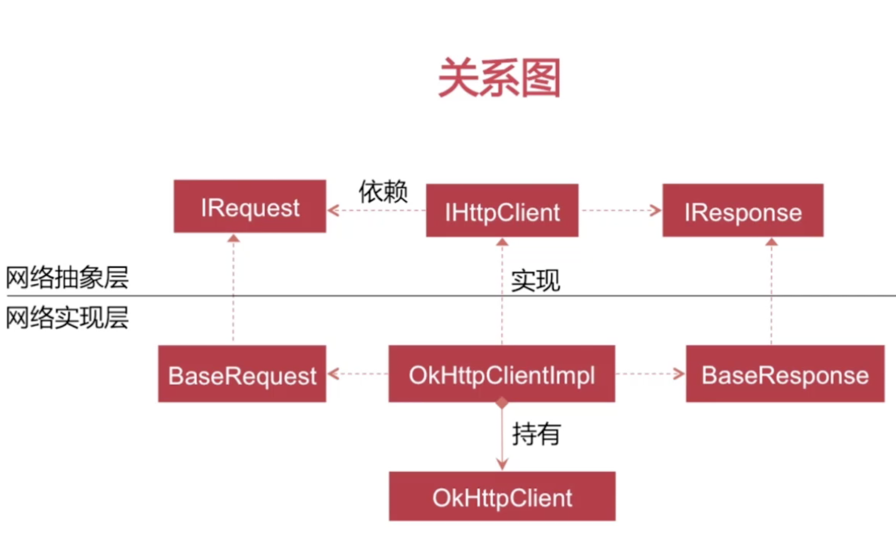
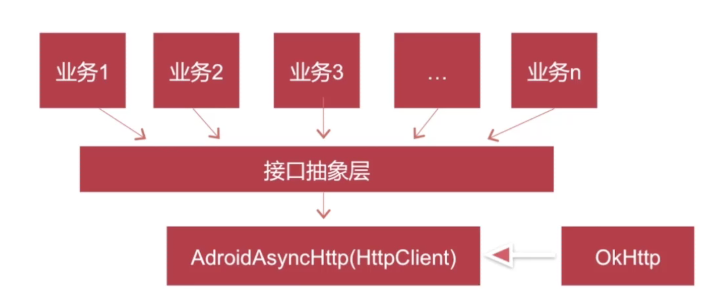

# 滴滴打车

## 章节一: 启动过渡页面开发
### A. SVG 用法
SVG 有何优点?
- SVG 可被非常多的工具读取和修改

- SVG 与 JPEG 和 GIF 图像比起来,尺寸更小,可压缩性更强

 
   
### B. SVG 制造logo
- M = moveTo (M X,Y) : 将画笔移动到指定的坐标位置

- L = lineTo(L X,Y) : 画直线到指定的坐标位置

- H = horizontal lineTo(H X) : 画水平线到指定的X坐标位置

- V = vertical lineTo(V Y) : 画垂直线到指定的Y坐标位置

- A = elliptical Arc(A RX, RY, XROTATION, FLAG1, FLAG2,X,Y) : 弧线


## 章节二: OKHttp3 的使用

- 为什么要选择 OkHttp

- OkHttp 的使用

- Get/Post 请求

- 拦截器
```
拦截器就是所有的请求和所有的响应,它都能截获到,
统计请求花费的时间和日志,拦截器是一种面向切面 IOP的思想
```
- 缓存


## 章节六: 基础网络模块—架构实现及OkHttp封装
 - 关系图
 
 
 
 - 怎么做封装?
 
 


